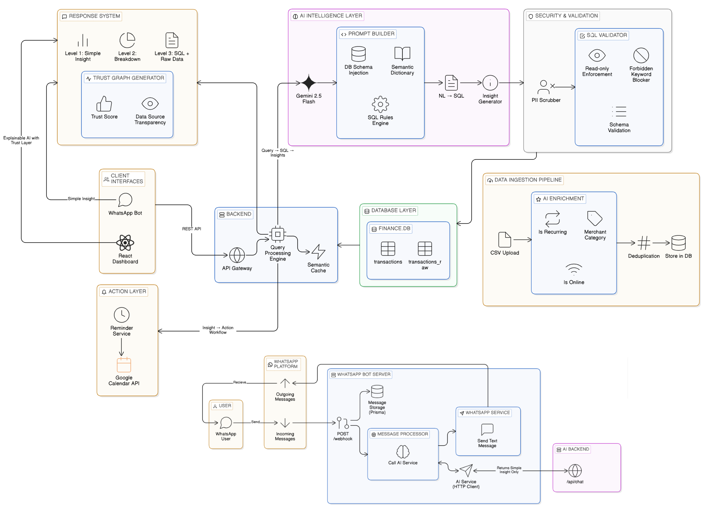

# 💳 MoneyLens — AI-Powered Credit Card Intelligence Assistant

> Ask questions about your money in plain English. Get answers you can trust.

---

## 📌 Overview

MoneyLens is an AI-powered financial assistant that lets users ask natural language questions about their credit card transactions and receive accurate, explainable insights — without needing SQL knowledge or Excel skills.

Users upload their bank statement CSV, then chat with their data via a web dashboard or WhatsApp. MoneyLens converts every question into a validated SQL query, runs it against a local SQLite database, and returns a transparent answer with the SQL used, raw data rows, and a confidence score. It also detects recurring subscriptions and automatically creates Google Calendar reminders with one click — and brings the same intelligence to WhatsApp via the Meta Business API.

**Intended users:** Any credit card holder who wants to understand their spending, track merchants, manage subscriptions, or get proactive reminders — without switching to a complex financial app.

---

## ❗ Problem Statement

People generate significant credit card transaction data every month but face real barriers:

- **Data is hard to understand** — statements arrive as CSV or PDF with no insight layer.
- **No natural language interface** — answering *"How much did I spend on food this month?"* requires SQL or manual Excel analysis.
- **No conversational access** — users cannot simply chat with their financial data.
- **Financial tools are fragmented** — they exist as separate apps, away from platforms users already use daily like WhatsApp.
- **No proactive reminders** — users forget credit card due dates and recurring subscription charges.

**Final problem statement:** Users need a system that allows them to ask natural language questions about their credit card transactions and get accurate, fast, and trustworthy insights — without technical knowledge — on platforms they already use.

---

## ✅ Features

The following features are implemented and working:

- **Natural Language Query Engine** — Ask questions like *"Which merchant charged me the most?"* or *"What did I spend on food in March?"* and get direct, accurate answers.
- **AI → SQL Conversion** — User questions are converted to safe SQL using Google Gemini 2.5 Flash with schema-aware prompting and a Semantic Dictionary (e.g., "spending" → debit transactions, "total" → `SUM(amount)`).
- **SQL Security Layer** — Only `SELECT` queries on the permitted schema are allowed. All destructive operations are blocked by the Forbidden Keyword Blocker and Schema Validator before execution.
- **3-Level Transparent Answer** — Every response includes a plain English insight (Level 1), a SQL breakdown (Level 2), and raw data rows (Level 3).
- **Trust Graph + Confidence Score** — Visual breakdown of how the answer was generated, showing data source transparency and confidence score (`TrustGraph.jsx`).
- **Semantic Cache** — Similar queries are matched and reused without triggering a new Gemini call, reducing latency and API cost.
- **Credit Card Data Pipeline** — CSV files are cleaned, normalised, AI-enriched with merchant category, recurring detection, and online/offline classification, then deduplicated and stored in SQLite.
- **Subscription Detection + Google Calendar Reminders** — The AI detects expiring subscriptions from transaction data and displays them in a dedicated chat tab. Users can bulk-create Google Calendar reminders for all detected subscriptions in one click, with OAuth 2.0 handled automatically via a popup window.
- **Chat-Based Dashboard** — Web interface with persistent chat history, sidebar navigation, and multi-tab answer cards: Answer, SQL, Execution Plan, Trust Graph, and Subscriptions.
- **WhatsApp Integration** — Users send questions on WhatsApp (Meta Business API) and receive short, instant answers. Conversations are stored in PostgreSQL via Prisma.
- **PII Protection** — Card numbers, phone numbers, and email addresses are scrubbed from all data before it reaches the AI model.

---

## 🏗️ System Architecture



The system is composed of six interconnected layers:

**AI Intelligence Layer** — Google Gemini 2.5 Flash receives the cleaned query. The Prompt Builder injects the DB schema and Semantic Dictionary to generate accurate SQL. The SQL Rules Engine and Insight Generator produce the final response.

**Security & Validation** — Every AI-generated SQL passes through the SQL Validator: read-only enforcement, forbidden keyword blocking, and schema validation. The PII Scrubber removes sensitive data before it reaches the AI.

**Backend** — The API Gateway routes requests to the Query Processing Engine. The Semantic Cache intercepts repeated or similar queries to avoid redundant Gemini calls.

**Database Layer** — `finance.db` (SQLite) holds two tables: `transactions` and `transactions_raw`. All queries run against this local database.

**Data Ingestion Pipeline** — CSV uploads are AI-enriched (`is_recurring`, `merchant_category`, `is_online`), deduplicated by file hash, and stored in the database.

**Response System** — The Trust Graph Generator produces the 3-level answer (Level 1: Simple Insight, Level 2: Breakdown, Level 3: SQL + Raw Data) with a Trust Score and Data Source Transparency view.

**Action Layer** — When subscriptions are detected, the Reminder Service triggers the Google Calendar API to create events automatically.

---

## 📸 Screenshots

### Dashboard — Chat Interface with Subscription Reminders


### WhatsApp — Live Conversation


---

## 🗂️ Project Structure

```
MoneyLens-Chat/
├── aiSystemBackend/              # Python + FastAPI + Gemini + SQLite + Google Calendar
│   ├── app/
│   │   ├── ai/                   # agents.py, prompts.py, security.py
│   │   ├── core/                 # config.py
│   │   ├── db/                   # database.py
│   │   ├── routes/               # calender_routes.py (OAuth + Calendar API)
│   │   └── services/             # query_service.py
│   ├── data/
│   │   ├── raw/                  # Uploaded CSVs (gitignored)
│   │   └── finance.db            # SQLite database (gitignored)
│   ├── scripts/
│   ├── data_pipeline.py
│   ├── requirements.txt
│   ├── runtime.txt
│   └── render.yaml
│
├── frontEnd/                     # React + TypeScript + Vite + Tailwind
│   ├── src/
│   │   ├── components/
│   │   │   ├── ChatMessage.jsx
│   │   │   ├── TrustGraph.jsx
│   │   │   ├── ConfirmRemindersModal.jsx
│   │   │   ├── SubscriptionCard.jsx
│   │   │   ├── Sidebar.jsx
│   │   │   ├── ChatCards.jsx
│   │   │   ├── ChatHeader.jsx
│   │   │   ├── ChatHistoryItem.jsx
│   │   │   └── ChatInput.jsx
│   │   └── pages/
│   │       ├── Dashboard.jsx
│   │       └── ReminderForm.jsx
│   ├── package.json
│   └── vite.config.ts
│
├── whatsapp_bot/                 # Node.js + TypeScript + Meta API + PostgreSQL
│   ├── src/
│   │   ├── lib/                  # prisma.ts
│   │   ├── routes/               # whatsapp.routes.ts
│   │   └── services/             # ai.service.ts, whatsapp.service.ts
│   ├── prisma/
│   ├── config.ts
│   ├── index.ts
│   └── package.json
│
├── utility/                      # Architecture diagrams and screenshots
│   ├── SystemArchitecture.png
│   ├── aiSystemBackend.png
│   ├── dataFlowDiagramAisystemBacken...png
│   ├── whatsappBotArchitrecture.png
│   ├── whatsapp features visulaization.png
│   └── calandervisualization.png
│
├── .gitignore
├── LICENSE
└── README.md
```

---

## 📦 Module READMEs

| Module | README | Stack |
|---|---|---|
| AI Backend | [`aiSystemBackend/README.md`](./aiSystemBackend/README.md) | Python, FastAPI, SQLite, Gemini 2.5 Flash, Google Calendar API |
| Dashboard | [`frontEnd/README.md`](./frontEnd/README.md) | React, TypeScript, Vite, Tailwind CSS |
| WhatsApp Bot | [`whatsapp_bot/README.md`](./whatsapp_bot/README.md) | Node.js, TypeScript, Prisma, PostgreSQL, Meta API |

---

## 🚀 Quickstart — Run All Three Together

**Terminal 1 — AI Backend:**
```bash
cd aiSystemBackend
python -m venv venv
source venv/bin/activate        # Windows: venv\Scripts\activate
pip install -r requirements.txt
# Add GEMINI_API_KEY to .env
# Place credentials.json (Google OAuth) in app/routes/
# Place CSV in data/raw/, then:
python data_pipeline.py
uvicorn app.main:app --reload
# API: http://localhost:8000
```

**Terminal 2 — Frontend Dashboard:**
```bash
cd frontEnd
npm install
npm run dev
# Dashboard: http://localhost:5173
```

**Terminal 3 — WhatsApp Bot:**
```bash
cd whatsapp_bot
npm install
cp .env.example .env            # Fill in Meta + PostgreSQL + AI_API_URL
npx prisma generate
npx prisma migrate deploy
npm run build && npm start
# Bot: http://localhost:3001
```

---

## 🧪 Usage Examples

### Dashboard — Spending Query

```
You:        How much did I spend on food last month?

MoneyLens:  ₹4,280 on food in March 2025
            [Answer]  [SQL]  [Execution Plan]  [Trust Graph]

            SQL:    SELECT SUM(amount) FROM transactions
                    WHERE category = 'Food'
                    AND strftime('%Y-%m', date) = '2025-03'
            Trust:  94% confidence
```

### Dashboard — Subscription Reminder

```
You:        Which subscriptions are expiring soon?

MoneyLens:  Found 3 expiring subscriptions.
            [Answer]  [SQL]  [Execution Plan]  [Trust Graph]  [Subscriptions ✦]

            Subscriptions tab:
            • Netflix       ₹649   — expires May 15
            • Spotify       ₹299   — expires Jun 01
            • Amazon Prime  ₹1,499 — expires Jun 10

            → Click "Create Reminders"
            → Google OAuth popup (first time only)
            → Confirm → ✅ 3 calendar events created at 9:00 AM IST
```

### WhatsApp — Quick Query

```
You:        Which merchant charged me the most this month?
MoneyLens:  Airbnb charged you the most this month, with a total of ₹5,000 spent.
```

---

## ⚠️ Limitations

- Google Gemini API requires a valid key from Google AI Studio; the free tier has rate limits.
- Google Calendar integration requires completing a one-time OAuth 2.0 flow and a Google Cloud project with Calendar API enabled.
- Meta WhatsApp Business API requires an approved Meta Developer app; not available instantly.
- `finance.db` is a local SQLite file — resets on redeployment unless a persistent disk is attached.
- CSV ingestion is tested against HDFC and ICICI statement formats; other banks may need column mapping adjustments.
- The AI query engine handles single-table queries; multi-table joins are not yet supported.
- Semantic cache is in-memory and resets on server restart.
- The WhatsApp bot does not support CSV uploads; ingestion must be done via the dashboard.
- Calendar reminder timezone is currently hardcoded to `Asia/Kolkata`.

---

## 🚀 Future Improvements

- Multi-bank CSV auto-detection (SBI, Axis, Kotak, Yes Bank).
- Redis-backed persistent semantic cache surviving server restarts.
- Budget alerts — notify when spending in a category exceeds a user-set threshold.
- Monthly trend reports and projected end-of-month spend forecasting.
- Configurable reminder time and timezone from user settings.
- Recurring reminders for subscription renewals, not just expiry.
- Voice message support on WhatsApp (speech-to-text → query pipeline).
- Multi-card and multi-user account management.
- UPI and debit transaction ingestion support.

---

## 🔐 Security & Compliance

- All API keys and credentials are loaded via environment variables. See `.env.example` in each module.
- No real credentials, tokens, or `credentials.json` are committed to the repository.
- SQL Validator enforces a strict allowlist — only `SELECT` on permitted tables is executed.
- PII (card numbers, names, contact info) is scrubbed before data reaches the LLM.
- Google OAuth tokens are stored server-side only and never in browser storage.

---

## 📄 License

Apache License 2.0 — see [`LICENSE`](./LICENSE).

All commits signed off per DCO:
```bash
git commit -s -m "your commit message"
```

*Built for NatWest Group — Code for Purpose India Hackathon.*