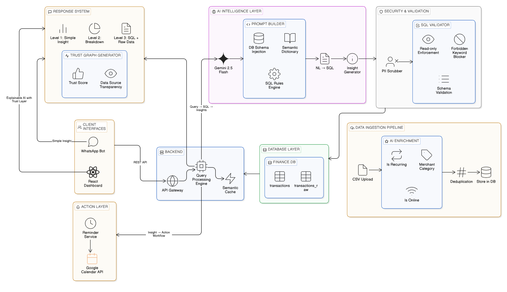

# 🧠 MoneyLens — AI System Backend

The core intelligence engine of MoneyLens. A Python FastAPI server that receives natural language questions, converts them to validated SQL using Google Gemini 2.5 Flash, executes them against a SQLite transaction database, and returns 3-level explainable answers with a trust score. It also detects recurring subscriptions and automatically creates Google Calendar reminders via OAuth 2.0.

---

## 📌 What This Module Does

- Accepts natural language queries from the Dashboard and WhatsApp Bot via `POST /api/chat`.
- Uses Google Gemini 2.5 Flash (`agents.py`) with schema-aware prompts and a Semantic Dictionary (`prompts.py`) to generate SQL.
- Validates every generated SQL query through a security layer (`security.py`) — read-only enforcement, forbidden keyword blocking, schema validation, and PII scrubbing.
- Executes validated queries on `finance.db` (SQLite) containing `transactions` and `transactions_raw` tables.
- Returns structured 3-level responses: plain insight, SQL breakdown, raw data rows, execution plan, and trust graph.
- Detects expiring recurring subscriptions from transaction data and exposes them in the chat response.
- Handles Google OAuth 2.0 and creates Google Calendar reminder events in bulk for detected subscriptions.
- Ingests credit card CSV files via `data_pipeline.py`, enriches them with AI (merchant category, recurring detection, online classification), deduplicates by file hash, and loads into SQLite.

---

## 🏗️ Architecture

### System Layer Diagram



The backend is structured into six layers that work together:

| Layer | Components | Purpose |
|---|---|---|
| **AI Intelligence** | Gemini 2.5 Flash, Prompt Builder, SQL Rules Engine, Insight Generator | Converts NL → SQL → Insight |
| **Security & Validation** | SQL Validator, PII Scrubber, Schema Validator, Forbidden Keyword Blocker | Ensures safe, read-only execution |
| **Backend** | API Gateway, Query Processing Engine, Semantic Cache | Routes and orchestrates requests |
| **Database** | `finance.db` → `transactions`, `transactions_raw` | Stores and serves financial data |
| **Data Ingestion** | CSV Upload, AI Enrichment, Deduplication | Populates the database |
| **Response System** | Trust Graph Generator, Level 1/2/3 formatter | Builds the explainable response |
| **Action Layer** | Reminder Service, Google Calendar API | Creates subscription reminders |

---

### Data Flow Diagram


**Step-by-step flow:**

```
User Query
    │
    ▼
INPUT PROCESSING
Remove Sensitive Data (PII Scrubber)
    │
    ▼
BACKEND
Query Processing Engine
    ├── Check Semantic Cache ──► Cache Hit → skip to Output Channels
    │   Cache Miss ↓
    ▼
AI PROCESSING
Gemini 2.5 Flash → Build Prompt → Generate SQL
    │
    ▼
SECURITY VALIDATION
Validate SQL (read-only, allowlist check)
    │
    ▼
Finance Database (SQLite)
    │
    ▼
INSIGHT PROCESSING
Generate Insights → Format Response → Calculate Trust Score
    │
    ├──► ACTION SYSTEM: Trigger Reminders (Google Calendar)
    │
    └──► OUTPUT CHANNELS
         ├── Web Response  (Dashboard — full 3-level detail)
         └── WhatsApp Response  (short plain answer only)
```

---

### Google Calendar Reminder Flow


---

## 🗂️ Folder Structure

```
aiSystemBackend/
├── app/
│   ├── ai/
│   │   ├── agents.py               # AI agent — NL → SQL + semantic cache + subscription detection
│   │   ├── prompts.py              # Schema injection + Semantic Dictionary + SQL rules
│   │   └── security.py             # SQL allowlist + PII scrubber + schema validator
│   ├── core/
│   │   └── config.py               # Environment variable loading
│   ├── db/
│   │   └── database.py             # SQLite connection, query execution
│   ├── routes/
│   │   ├── calender_routes.py      # Google Calendar OAuth + batch reminder creation
│   │   ├── credentials.json        # Google OAuth credentials — NOT committed to repo
│   │   └── token.json              # Auto-generated user token — NOT committed to repo
│   ├── services/
│   │   └── query_service.py        # Pipeline orchestration + trust score builder
│   ├── __init__.py
│   └── main.py                     # FastAPI app, routes, CORS
├── data/
│   ├── raw/                        # Place CSV files here before pipeline
│   └── finance.db                  # SQLite database — NOT committed to repo
├── scripts/
├── data_pipeline.py                # CSV ingestion + AI enrichment + SQLite loader
├── .env.example
├── requirements.txt
├── runtime.txt
└── render.yaml
```

---

## ⚙️ Tech Stack

| Layer | Technology |
|---|---|
| Language | Python 3.10+ |
| Framework | FastAPI |
| Database | SQLite (`finance.db`) |
| AI / LLM | Google Gemini 2.5 Flash |
| Calendar | Google Calendar API v3 |
| Auth | Google OAuth 2.0 |
| DB Access | Python `sqlite3` |
| Server | Uvicorn |
| Deployment | Render.com |

---

## 🧾 Prerequisites

- **Python 3.10 or higher** — [https://python.org](https://python.org)
- `pip` and `git`
- **Google Gemini API Key** — [https://aistudio.google.com](https://aistudio.google.com)
- **Google Cloud Project** with Calendar API enabled and OAuth 2.0 credentials (Web application)

---

## ⚙️ Install & Run

### Step 1 — Clone the Repository

**Mac / Linux:**
```bash
git clone https://github.com/YOUR_USERNAME/YOUR_REPO.git
cd YOUR_REPO/aiSystemBackend
```

**Windows:**
```cmd
git clone https://github.com/YOUR_USERNAME/YOUR_REPO.git
cd YOUR_REPO\aiSystemBackend
```

---

### Step 2 — Create a Virtual Environment

**Mac / Linux:**
```bash
python -m venv venv
source venv/bin/activate
```

**Windows:**
```cmd
python -m venv venv
venv\Scripts\activate
```

You should see `(venv)` at the start of your terminal prompt.

---

### Step 3 — Install Dependencies

```bash
pip install -r requirements.txt
```

---

### Step 4 — Configure Environment Variables

**Mac / Linux:**
```bash
cp .env.example .env
```

**Windows:**
```cmd
copy .env.example .env
```

Open `.env` and fill in:

```properties
GEMINI_API_KEY=your_google_gemini_api_key
```

> Get your key at [https://aistudio.google.com/app/apikey](https://aistudio.google.com/app/apikey)

---

### Step 5 — Set Up Google Calendar OAuth

**5.1 — Create a Google Cloud Project**

1. Go to [https://console.cloud.google.com](https://console.cloud.google.com)
2. Create or select a project.

**5.2 — Enable the Calendar API**

1. APIs & Services → Enabled APIs → Enable APIs and Services.
2. Search **Google Calendar API** → Enable.

**5.3 — Create OAuth 2.0 Credentials**

1. APIs & Services → Credentials → Create Credentials → OAuth 2.0 Client ID.
2. Choose **Web application**.
3. Add Authorized Redirect URI:
   ```
   http://localhost:8000/auth/callback
   ```
4. Download the credentials JSON file.

**5.4 — Place the Credentials File**

```bash
# Mac / Linux
cp ~/Downloads/client_secret_*.json app/routes/credentials.json
```

```cmd
# Windows — rename the downloaded file and move it to:
app\routes\credentials.json
```

> `credentials.json` is in `.gitignore` — never commit it.

---

### Step 6 — Set Up the Database

**Step 6.1 — Add CSV files**

Place your credit card statement CSVs inside:
```
aiSystemBackend/data/raw/
```

**Step 6.2 — Run the data pipeline**

```bash
python data_pipeline.py
```

What this does:
- Reads CSVs from `data/raw/`
- Cleans and normalises transaction data
- Generates `billing_cycle_month` and `billing_cycle_year`
- AI-enriches each transaction: `merchant_category`, `is_recurring`, `is_online`
- Deduplicates uploads via file hash
- Stores results in `data/finance.db`

---

### Step 7 — Start the Backend Server

**Mac / Linux:**
```bash
uvicorn app.main:app --host 127.0.0.1 --port 8000 --reload
```

**Windows (PowerShell):**
```powershell
$env:PYTHONPATH="C:\path\to\MoneyLens-Chat\aiSystemBackend"
python -m uvicorn app.main:app --host 127.0.0.1 --port 8000
```

**Expected output:**
```
INFO:     Application startup complete.
INFO:     Uvicorn running on http://127.0.0.1:8000 (Press CTRL+C to quit)
```

---

### Step 8 — Test the API

**Health check:**
```bash
# Mac/Linux
curl http://localhost:8000/health
# Expected: { "status": "ok" }
```

**Chat query:**
```bash
# Mac/Linux
curl -X POST http://localhost:8000/api/chat \
  -H "Content-Type: application/json" \
  -d '{"message": "How much did I spend last month?"}'
```

```powershell
# Windows PowerShell
Invoke-WebRequest -Uri http://localhost:8000/api/chat `
  -Method POST `
  -Headers @{"Content-Type"="application/json"} `
  -Body '{"message": "How much did I spend last month?"}'
```

---

## 📡 API Reference

### `POST /api/chat`

**Request:**
```json
{ "message": "How much did I spend last month?" }
```

**Response:**
```json
{
  "question": "How much did I spend last month?",
  "level_1_simple_answer": "You spent ₹18,750 in March 2025.",
  "level_2_sql_query": "SELECT SUM(amount) FROM transactions WHERE ...",
  "level_3_raw_data": [{ "SUM(amount)": 18750 }],
  "execution_plan": { "steps": ["parse intent", "generate SQL", "validate", "execute"] },
  "trustGraph": { "confidence": 94, "reasoning": "Direct aggregate on filtered date range" }
}
```

### `GET /auth/login`
Returns the Google OAuth authorization URL to open in a popup.

### `GET /auth/callback`
OAuth callback — called automatically by Google after the user grants permission.

### `GET /auth/status`
Returns `{ "is_authenticated": true/false, "email": "..." }`.

### `POST /batch-create-reminders`

**Request:**
```json
{
  "subscriptions": [
    { "name": "Netflix",  "amount": 649, "currency": "INR", "expiry_date_str": "2026-05-15" },
    { "name": "Spotify",  "amount": 299, "currency": "INR", "expiry_date_str": "2026-06-01" }
  ]
}
```

**Response:**
```json
{
  "message": "Created 2 reminder(s)",
  "created_count": 2,
  "created_ids": ["event_id_1", "event_id_2"],
  "errors": [],
  "error_count": 0
}
```

> All reminders are created at **9:00 AM IST (Asia/Kolkata)** on the expiry date with email + popup notifications.

---

## 🔐 Security Notes

- All config is loaded from environment variables via `config.py` — no hardcoded secrets.
- `security.py` validates every AI-generated SQL: only `SELECT` on permitted tables is executed.
- PII is scrubbed before data reaches Gemini.
- `credentials.json` and `token.json` are in `.gitignore` and must never be committed.
- OAuth tokens are stored server-side only in `app/routes/token.json` — never sent to the browser.
- Tokens auto-refresh on expiry; users only re-authenticate if the refresh token is revoked.

---

## 🛠️ Common Issues

| Problem | Fix |
|---|---|
| `ModuleNotFoundError: No module named 'app'` | Set PYTHONPATH: `$env:PYTHONPATH="path\to\aiSystemBackend"` (Windows) or `export PYTHONPATH=.` (Mac/Linux) |
| `GEMINI_API_KEY` error | Check `.env` exists and has the correct key with no extra spaces |
| `finance.db` not found | Run `python data_pipeline.py` before starting the server |
| `credentials.json` not found | Follow Step 5 — download from Google Cloud Console |
| `401 Not authenticated` on calendar | Click "Connect Google Calendar" in the dashboard modal |
| `Token file is empty` | Delete `app/routes/token.json` and re-authenticate |
| Port 8000 in use | Add `--port 8001` to the uvicorn command |
| Virtual env not activating (Windows) | Run `Set-ExecutionPolicy RemoteSigned` in PowerShell first |

---

## ⚠️ Limitations

- SQLite is used for portability; not suitable for concurrent write-heavy production loads.
- AI query engine handles single-table queries only; multi-table joins not yet supported.
- CSV ingestion tested against HDFC and ICICI formats; other banks may need column mapping.
- `finance.db` resets on Render.com redeployment without a persistent disk.
- Gemini free tier has rate limits; high-volume usage may require a paid plan.
- Calendar reminder timezone is hardcoded to `Asia/Kolkata`; configurable timezone is a planned improvement.
- Google Calendar OAuth redirect URI must be updated to production URL before deploying.