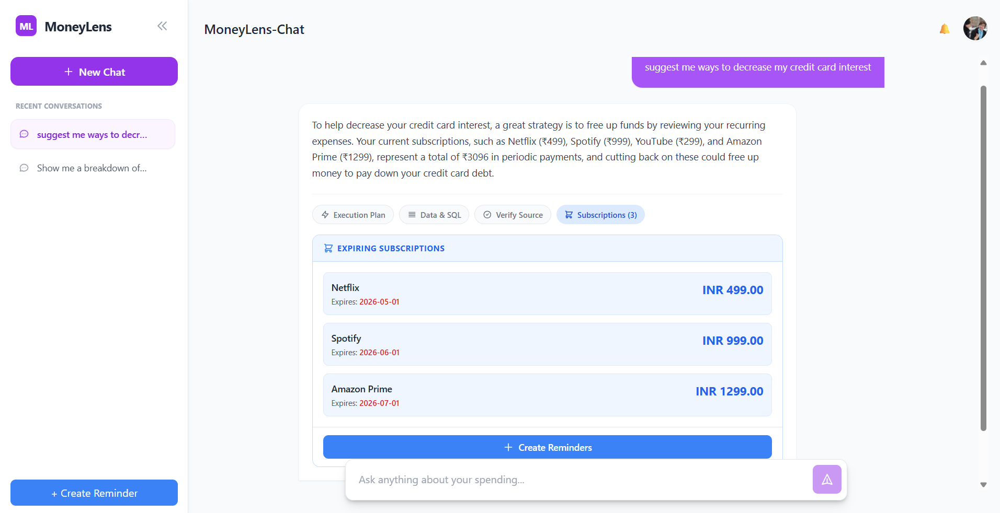

# 🖥️ MoneyLens — Frontend Dashboard

The chat-based web dashboard for MoneyLens. Built with React + TypeScript + Vite + Tailwind CSS. Users upload their credit card CSV, ask natural language questions, and see detailed answers with generated SQL, raw data rows, and a visual trust score.

---

## 📌 What This Module Does

- Provides a chat interface for users to ask financial questions in plain English.
- Sends questions to the `aiSystemBackend` and displays structured 3-level answers.
- Shows the generated SQL, raw data, execution plan, and a visual trust graph (`TrustGraph.jsx`).
- Maintains persistent chat history in a sidebar (`Sidebar.jsx`, `ChatHistoryItem.jsx`).
- Displays answer cards with full detail (`ChatCards.jsx`, `ChatMessage.jsx`).
- Handles CSV file upload to trigger the AI backend data pipeline.

---

## 📸 Screenshots

### Dashboard — Chat Interface with Subscription Reminders



---

## 🗂️ Folder Structure

```
frontEnd/
├── src/
│   ├── components/
│   │   ├── ChatCards.jsx        # Answer card — shows data details and summary
│   │   ├── ChatHeader.jsx       # Top navigation bar
│   │   ├── ChatHistoryItem.jsx  # Individual past conversation entry in sidebar
│   │   ├── ChatInput.jsx        # Message input field and send button
│   │   ├── ChatMessage.jsx      # Full message bubble with answer, SQL, and rows
│   │   ├── Sidebar.jsx          # Left panel — chat history list
│   │   └── TrustGraph.jsx       # Visual confidence score and reasoning breakdown
│   ├── pages/
│   │   └── Dashboard.jsx        # Main page — layout, state management, API calls
│   ├── App.tsx                  # App root and routing
│   ├── main.tsx                 # Vite entry point
│   └── index.css                # Global Tailwind styles
├── public/
├── index.html
├── package.json
├── package-lock.json
├── tailwind.config.js
├── postcss.config.js
├── vite.config.ts
├── tsconfig.json
├── tsconfig.app.json
├── tsconfig.node.json
├── eslint.config.js
└── .env.example
```

---

## ⚙️ Tech Stack

| Layer | Technology |
|---|---|
| Language | TypeScript |
| Framework | React 18 |
| Build Tool | Vite |
| Styling | Tailwind CSS |
| HTTP Client | Fetch API |
| Linting | ESLint |

---

## 🧾 Prerequisites

Ensure you have:

- **Node.js v18 or higher** — download from [https://nodejs.org](https://nodejs.org)
- **AI Backend running** at `http://localhost:8000` — see [`aiSystemBackend/README.md`](../aiSystemBackend/README.md)
- `git`

---

## ⚙️ Install & Run

### Step 1 — Navigate to This Folder

**Mac / Linux:**
```bash
cd frontEnd
```

**Windows:**
```cmd
cd frontEnd
```

---

### Step 2 — Configure Environment Variables

**Mac / Linux:**
```bash
cp .env.example .env
```

**Windows:**
```cmd
copy .env.example .env
```

Open `.env` and fill in:

```properties
VITE_API_BASE_URL=http://localhost:8000
```

> This tells the dashboard where to send queries. If your backend runs on a different port, update this value.

---

### Step 3 — Install Dependencies

**Mac / Windows (same command):**
```bash
npm install
```

---

### Step 4 — Start the Development Server

**Mac / Windows (same command):**
```bash
npm run dev
```

You should see:
```
  VITE v5.x.x  ready in 300ms

  ➜  Local:   http://localhost:5173/
  ➜  Network: use --host to expose
```

Open `http://localhost:5173` in your browser.

---

### Step 5 — Build for Production

```bash
npm run build
```

Output is placed in `dist/`. Preview the production build locally:
```bash
npm run preview
```

---

## 🧪 Usage

### Asking a Question

1. Make sure the AI backend is running at `http://localhost:8000`.
2. Open `http://localhost:5173` in your browser.
3. Upload your credit card CSV using the upload button.
4. Type a question in the chat input at the bottom, for example:

```
What did I spend on subscriptions this month?
```

The answer appears as a chat message with:
- **Level 1** — Plain English answer
- **Level 2** — SQL query that was generated and executed
- **Level 3** — Raw data rows returned from the database
- **Trust Graph** — Visual confidence score and reasoning chain

### Chat History

All conversations are accessible from the left sidebar. Click any previous session to reload it.

---

## 🔐 Notes

- The dashboard communicates only with the local `aiSystemBackend`. No financial data is sent directly to any external service from the frontend.
- Only the backend API URL (`VITE_API_BASE_URL`) is required in the frontend `.env`. No AI API keys go here.

---

## 🛠️ Common Issues

| Problem | Fix |
|---|---|
| `node` not found | Install Node.js v18+ from https://nodejs.org and restart terminal |
| `npm install` fails | Delete `node_modules/` and `package-lock.json`, then run `npm install` again |
| Blank screen on load | Check that the backend is running and `VITE_API_BASE_URL` is set correctly |
| CORS error in browser | Make sure the backend has CORS enabled for `http://localhost:5173` |
| Port 5173 already in use | Add `--port 5174` to the `npm run dev` command |

---

## ⚠️ Limitations

- Chat history is stored in browser local storage; clearing the browser cache will remove all history.
- CSV upload progress indicator is not yet implemented — the UI shows a loading state until the backend responds.
- Optimised for desktop use; mobile layout is partially responsive.
- The dashboard requires an active connection to the backend; it does not work offline.